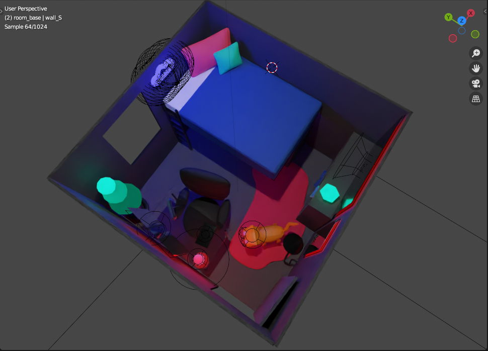
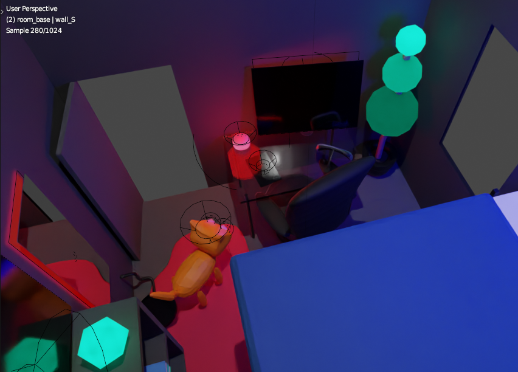

# subtle
Exploration of a subtly dystopian surveillance tech-fueled future. Made with Blender, never got around to transforming it into a web app.

I wanted to incorporate warnings drawn from (very much ongoing and non-futuristic) stories such as [this](https://www.washingtonpost.com/technology/2020/11/12/test-monitoring-student-revolt/) and [this](https://www.washingtonpost.com/technology/2020/12/10/amazon-halo-band-review/). I use the word "subtle/y" not because I think this kind of world is not-quite-dystopian, but because its dystopian qualities seem underrecognized (as of now). If you end up taking this model (or the general idea) further, please let me know &mdash; I would love to see! (Or if you want to collaborate on this &mdash; to be honest, I dropped this project because I anticipated a lot of overhead / time dedicated to learning 3D that I don't have right now.)

Screenshots:

